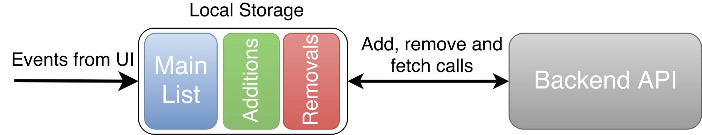
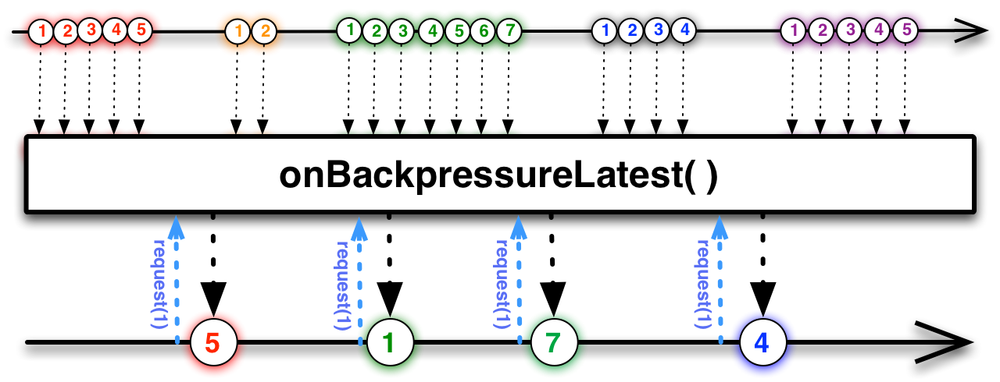

# Switchman - backend calls optimization using RxJava.
Users love fast, responsive apps. They don't want to hear about API calls take time. They want to
see updates immediately. Right *now*. That could lead to increased engaging. With all positive
impacts on the business, that most likely means increased usage of network and battery. So it is in
ours and users' interests to optimize amount of network calls.

This repo contains an example of optimizing API calls using RxJava. Along with an example there is 
an optional challenge exercise. Before reading the solution you can try to solve the problem on your own 
against tests. There are 29 tests to verify that your solution works! Please check the "Challenge" 
section below for more details.

You can find full article about it [here](https://medium.freecodecamp.org/want-to-optimize-network-usage-check-out-local-storage-and-rxjava-backpressure-8b91b1db298a).

# Problem
The task is to develop a feature that allows the user to add items to and remove  from a certain list. 
The list is stored on our back end.

Implementation must fulfill the following requirements:
* __The user interface reacts immediately to the user’s actions.__ The user wants to see the 
results of their actions immediately. If later we can’t synchronize those changes, we should 
notify our user, and roll back to the previous state.
* __Interaction from multiple devices is supported.__ This doesn’t mean that we need to support 
changes in real time, but we do need to fetch the whole collection from time to time. Plus, our 
back end provides us with API endpoints for additions and removals, which we must use to support 
better synchronization.
* __Integrity of the data is guaranteed.__ Whenever a synchronization call fails, our app should 
recover gracefully from errors.

The architectural decisions are discussed in a separate [article](https://medium.freecodecamp.com/how-leverage-local-storage-to-build-lightning-fast-apps-4e8218134e0c).
This example is focused on optimizing the amount of calls to the back end in a concise way by using 
RxJava Backpressure.

You can find full article about this example here {TK add link to published article}.

## Formal Definition
We need to develop the following interface:
```java
interface ItemRepository {
    Single<List<? extends Item<ItemId>>> getItemList();
    Observable<Integer> getCounter();
    boolean hasItem(ItemId id);
    Single<Response> addItem(ItemId id);
    Single<Response> removeItem(ItemId id);
}
```

Where methods `addItem()` and `removeItem()` can be called in any order with any arguments. To 
avoid sending unnecessary information, both methods needs only `itemId`, while `getItemList()` 
returns complete items.

Please take into account that `getCounter()` returns an `Observable` that emits an amount of items 
in collection any time a change happens to the local representation of the collection. That means, 
that, for example, we increase the counter every time new item is added, even though synchronization 
with back end is not finished yet.

Back end API is the following:
```java
public interface Api {
    Single<List<? extends Item<ItemId>>> getItemList();
    Single<ApiResponse> addItem(ItemId id);
    Single<ApiResponse> removeItem(ItemId id);
}
```


# Challenge
Inspired by article [“Practical Challenges For RxJava Learners”](https://medium.com/proandroiddev/practical-challenges-for-rxjava-learners-1821c454de9) 
by Sergii Zhuk, I decided to create a separate [branch](https://github.bus.zalan.do/nkozlov/Switchman/tree/challenge) 
only with basic classes and tests, so you can solve them by yourself and then compare your solution 
with mine. In total there are 28 tests. They are splitted into 4 parts according to functionality:
1. __Fetching.__ Fetching the list from API and checking what contains in it.
2. __Adding and removing.__ Checking that proper API methods are called and state of the repository 
is changing accordingly.
3. __Counter changes.__ Some screens would want to display total amount of items in 
the list. That part of functionality is tested in this part.
4. __Backend calls optimisation.__ Even though the user would want to add/remove a single item as 
many times as he/she wants, backend should not be abused.

Obviously there is more then one way to optimize backend calls, so it could be useful to check 
"Optimization Strategy" section to help understand tests.  

# Solution

## Organizing Local Storage
For this particular case I prefer the following approach:



Main idea is that along with a local copy of the main collection, local storage has two extra lists 
— one for ongoing additions, and one for ongoing removals — to help recover from negative cases. To read 
more about it, please check the following article: [How to leverage Local Storage to build lightning-fast apps](https://medium.freecodecamp.com/how-leverage-local-storage-to-build-lightning-fast-apps-4e8218134e0c).

## Optimization Strategy
Obviously we should not launch all the requests to the back end at once. For example, a result adding and 
removing simultaneously same item is unpredictable, we don't know what request would be 
finished first. So operations on a single item should be queued and be launched one by one. 
Requests that deals with different items can go in parallel without problems.

Each queue consists of request for adding and removing this particular item. Lets take a closer 
look into one of them. The most important requests are: the latest to come and the last request 
that was launched. If they are the same, for example, they are both "add", then you can skip the whole queue and do 
nothing. If they are different, then once the current request finished you can launch the 
latest one and skip everything in the middle. 

Also I do believe that `ItemRepository` should start syncing with the backend as soon as it has new 
data without any artificial delays. This is an opinionated statement and it is totally fine if you 
see it differently, it doesn't affect the main idea of this example, I'm mentioning it here just 
so you won't be surprised by the code behavior.

## Here comes RxJava
RxJava provides powerful mechanisms to manipulate data streams, lets use some of them to our advantage!

At first lets create events that represents user intention: `Add` and `Remove`. Now using `Subject` 
or `Relay` we can create a stream of those events, aka `inputStream`.

Second step is to implement queues by spliting this stream into multiple substreams of event 
grouped by the same `itemId`. To do this we will use `groupBy` operator that returns an `Observable` 
of `GroupedObservable`. Where each `GroupedObservable` is a queue from the optimization strategy. 

Obviously we don't want any of those observables to complete, so if something unexpected happen we 
want to be sure that data will continue to flow no matter what. And `groupBy` operator can help us 
with that. If any of the `GroupedObservable` is completed, for example because of an error, a new 
one will be created for you if an event with matching `itemId` will be in the stream. Now we can 
use `flatMap` to call our backend and transform each of those observables into a stream of results.
No optimizations is done yet, so the amount of calls matches the number of events.  


Third and the final step: optimization. Before we start lets check once more the optimization 
strategy. It says that we need to keep the latest event to come and the last launched one. It 
means that we can drop all the events in the middle! They just don't matter. 

Unfortunately we don't know how long each backend request takes or how often a new event is emitted,
so we can't use neither `window`, nor `buffer`, nor `throttle` to simulate required behaviour. We 
need that each `GroupedObservable` emits a new event only when ongoing call is finished. In other 
words, once the call is finished we need to ask `GroupedObservable` to emit a new item. That can be done by 
using reactive pull backpressure. More precisely we need an operator `onBackpressureLatest()`. It drops 
all the events except the last one, that will be emitted only when `Subscriber.request()` method 
is called.



Now lets do the call in the `Subscriber` so it will know when to call `request()`. It can also do 
the comparison between events.

## Third state of the request
Independently of dropping requests or making them, consumers of `ItemRepository` expect to 
get responses. It means that even if some requests are skipped we still need to return as many 
responses as calls for `addItem()` and `removeItem()` are made. There are two ways to deal with it:

1. We hide all optimizations from the consumer and act as all the requests are executed. That is 
good for encapsulation, because after performing optimizations you don't need to change consumers' 
code. But in some cases that means more complexity. For example, if we show a snackbar for each 
response and end-user made a lot of clicks for adding and removing same item, then we will spam 
him with notifications. To resolve this issue we have to implement some logic for dealing with such
cases or go for the second approach.
2. Lets be honest with consumers' of our API and add a third, "skipped", state of the response. 
From my experience I can say that it makes things simpler. In the example above we can just don't 
show notifications for all skipped requests.  

# Show me the code

`switchman` module contains code for the solution and tests.

In branch [challenge](https://github.bus.zalan.do/nkozlov/Switchman/tree/challenge) you can find 
tests without solutions.

`app` module is an example app with simulated delays and errors.

## Contributing

If you want to contribute, please check [contributing guidelines](CONTRIBUTING.md)

# Copyright

The MIT License (MIT) Copyright © 2017 Zalando SE, https://tech.zalando.com

Permission is hereby granted, free of charge, to any person obtaining a copy of this software and 
associated documentation files (the “Software”), to deal in the Software without restriction, 
including without limitation the rights to use, copy, modify, merge, publish, distribute, 
sublicense, and/or sell copies of the Software, and to permit persons to whom the Software is 
furnished to do so, subject to the following conditions:

The above copyright notice and this permission notice shall be included in all copies or 
substantial portions of the Software.

THE SOFTWARE IS PROVIDED “AS IS”, WITHOUT WARRANTY OF ANY KIND, EXPRESS OR IMPLIED, INCLUDING BUT 
NOT LIMITED TO THE WARRANTIES OF MERCHANTABILITY, FITNESS FOR A PARTICULAR PURPOSE AND 
NONINFRINGEMENT. IN NO EVENT SHALL THE AUTHORS OR COPYRIGHT HOLDERS BE LIABLE FOR ANY CLAIM, 
DAMAGES OR OTHER LIABILITY, WHETHER IN AN ACTION OF CONTRACT, TORT OR OTHERWISE, ARISING FROM, OUT 
OF OR IN CONNECTION WITH THE SOFTWARE OR THE USE OR OTHER DEALINGS IN THE SOFTWARE.

